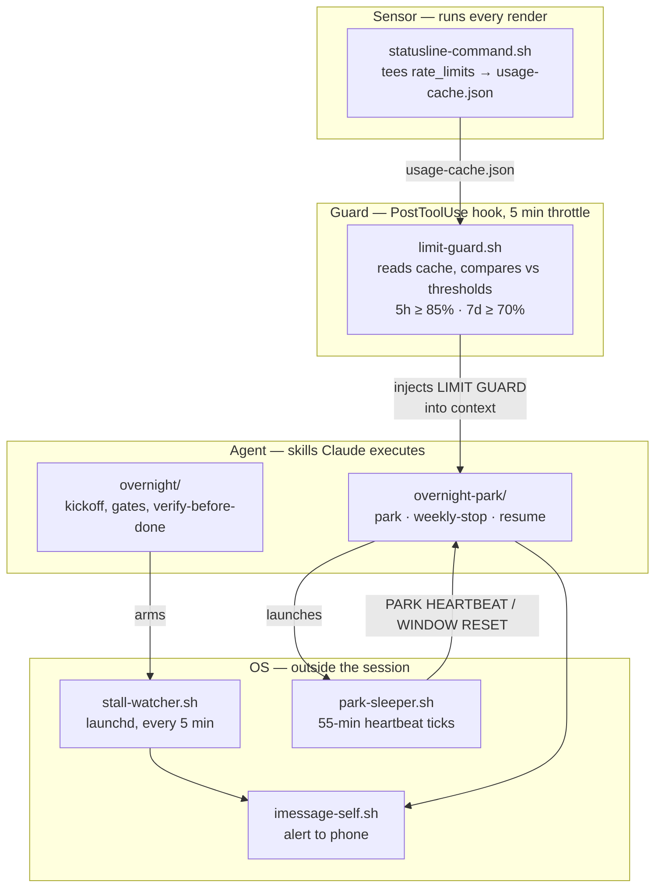

# claude-skills

My working [Claude Code](https://claude.ai/code) environment — the skills, hooks,
and background scripts I actually run day to day, extracted and de-personalized.

Everything here I wrote myself. Third-party and vendor skills I use are
[listed below](#third-party-skills-i-use-but-dont-vendor) but deliberately not
vendored — this repo is meant to show what I built, not what I installed.

The interesting part isn't the markdown. It's that several of these are not
prompts at all: `overnight` is a control loop spanning a status line, a
`PostToolUse` hook, a launchd agent, and a background sleeper process, built to
keep a long unattended run alive across subscription rate limits without burning
quota.

---

## Architecture

Skills alone can't observe or interrupt a run — they only execute once Claude
decides to invoke them. Anything that needs to *watch* has to live in the harness.
So the overnight stack splits across four layers:



Three design constraints drove that shape:

**The hook can't ask Claude to stop — it can only inject text.** So `limit-guard.sh`
writes a `LIMIT GUARD` message naming the exact skill, mode, and reset epoch, and
`overnight-park` is written to be triggered *only* by that injection. The hook is a
sensor with an opinion; the skill is the actuator.

**A parked session goes cold.** The naive park is one long `sleep` until the rate
limit resets. That means zero API turns for hours, the prompt cache expires, and
resuming re-ingests the entire transcript at full price. `park-sleeper.sh` instead
wakes every 55 minutes — inside the cache TTL — and each cheap tick keeps the lead
session warm. The skill's job on a heartbeat is to relaunch the sleeper and do
*nothing else*; padding the tick defeats the whole mechanism.

**Killed subagents must not be resumed.** Cold-resuming a large-context subagent
re-ingests its full transcript. Doing that to several at once once cost ~30% of a
5-hour window. So the park protocol treats stopped agents as abandoned: their
findings already live in the lead's context and in `docs/overnight-gates/`, and
resume spawns fresh small-context agents briefed from those files.

State files are keyed by `$CLAUDE_CODE_SESSION_ID` throughout, so concurrent
overnight runs in different projects don't clobber each other's park state — an
earlier version keyed them globally and one stalled session masked another.

---

## Flagship skills

### `overnight` + `overnight-park`

Runs an implementation task unattended, overnight, and survives hitting the
subscription rate limit mid-run.

- **Pre-flight**: refuses to start a run that won't fit the remaining weekly quota
  — the only permitted question, asked while the user is still awake.
- **Verified-not-implemented gate**: nothing is marked done until tests pass *and*,
  where there's a runtime surface, behavior was actually exercised. Waking up to a
  green checklist over a broken tree is the failure mode this exists to prevent.
- **Quality gates by diff shape** ([`gates.md`](skills/overnight/gates.md)):
  best-practices always; task-conformance on any multi-file step; security when the
  diff touches auth/crypto/IO/deserialization or adds a dependency; a11y when it
  touches UI surfaces. Gates that *didn't* fire get logged too — silent skipping
  reads as "reviewed" when it wasn't.
- **Task conformance as its own gate** ([`task-conformance-verifier`](agents/task-conformance-verifier.md)):
  the other three grade the *diff*, and all three pass a clean, well-written
  implementation of the wrong thing. This one gets the original task text verbatim —
  never the lead's restatement or the worker's account — and its mandatory
  `Not checked` section means unchecked never silently counts as passed.
- **Run ledger** (`docs/overnight-gates/ledger.md`): baseline commit, one row per
  atomic step with its declared write set, append-only attempt log. Gate reports
  dedup findings; the ledger is what survives a park/resume, so a resumed lead
  reconciles against `git status` instead of guessing.
- **Explicit model routing**: every subagent dispatch passes `model` explicitly.
  Omitting it inherits the lead's tier, and overnight leads deliberately run on a
  premium model for coordination quality — so an omitted param silently bills every
  grep and lint pass at lead rates.
- **Two limit modes**: 5h cap → park and resume. 7d cap → stop cleanly, because a
  fresh 5h window drawn from a dead weekly budget buys nothing.

### `design-mode`

The one that's pure judgment, no code. Encodes how a design conversation should go:
lead with a real position rather than "what do you think?", name the latent
distinction the user hasn't articulated yet, give concrete numbers with units,
partition v1/v1.x/v2 with reasons, surface adjacent risks unprompted, and end a turn
on the single load-bearing question rather than burying it.

Included because most of what makes an agent useful in design work is refusing to be
agreeable, and that turns out to be specifiable.

### `skillspector`

Wraps [NVIDIA SkillSpector](https://github.com/NVIDIA/skillspector) in Docker to scan
agent skills for malicious patterns *before* installing them. I run this on every
skill I install, from any source.

The non-obvious part is the triage guidance, which is most of the file. Both scanner
passes overstate: static/YARA mode flags any doc that merely *mentions* `rm -rf` or
`shell=True`, and the LLM pass reports data flows that read as RCE but never execute.
The skill's rule is to open the cited `file:line`, trace whether attacker-controlled
input actually reaches execution, and report ground truth — not the scanner's severity
verbatim. A security tool you relay uncritically is worse than none.

### `md2pdf`

Markdown → print-ready PDF via python-markdown → tuned CSS → headless Chrome, with a
mandatory two-step review: render the PDF pages back as images and inspect them, then
hand to a second-opinion subagent that judges print-readiness without knowing how the
file was produced.

The review steps are the skill. PDF generation is one-shot and unpreviewed — a clipped
table stays clipped forever once the file leaves the machine — and after choosing the
rendering parameters yourself you stop seeing its problems.

---

## Utilities

The long tail. Small, but they're most of what daily use actually looks like.

| Skill | What it does |
|---|---|
| [`session-log`](skills/session-log/SKILL.md) | Writes a structured session log to an Obsidian vault at conversation end, so decisions and rationale survive the context window. Paired with [a `Stop` hook](hooks/stop-session-log-guard.py) that won't let a substantive session end unlogged. Writes without prompting — see the scope banner in the skill for exactly what it touches. |
| [`commit-push`](skills/commit-push/SKILL.md) | Commit and push, no PR. Writes the message to a session-unique file — never `-m`, never a shared `/tmp` path, both of which have corrupted commits for me in practice. |
| [`screenshot`](skills/screenshot/SKILL.md) | Pulls the newest file from the screenshots folder into the conversation. Removes the drag-and-drop step from every visual debugging loop. |
| [`rename-to-dir`](skills/rename-to-dir/SKILL.md) | Renames the session to the working directory's basename. Three lines. Makes session history navigable when you keep a dozen open. |

---

## Layout

```
skills/           the skills themselves         → ~/.claude/skills/
hooks/            limit-guard.sh (PostToolUse)  → ~/.claude/hooks/
                  stop-session-log-guard.py (Stop)
scripts/          background helpers            → ~/.claude/scripts/
agents/           a11y-reviewer,                → ~/.claude/agents/
                  task-conformance-verifier
statusline/       rate-limit sensor             → ~/.claude/
launchagents/     stall-watcher plist           → ~/Library/LaunchAgents/
```

## Install

Copy what you want; nothing here depends on taking all of it. The four utilities
and `design-mode` are standalone — drop the directory into `~/.claude/skills/`
and you're done.

The overnight stack needs all four layers wired together:

```bash
ditto skills/overnight       ~/.claude/skills/overnight
ditto skills/overnight-park  ~/.claude/skills/overnight-park
ditto scripts                ~/.claude/scripts
ditto agents                 ~/.claude/agents
cp hooks/limit-guard.sh      ~/.claude/hooks/
cp statusline/statusline-command.sh ~/.claude/
chmod +x ~/.claude/hooks/limit-guard.sh ~/.claude/scripts/*.sh ~/.claude/statusline-command.sh
```

Then register the status line and hook in `~/.claude/settings.json`:

```json
{
  "statusLine": {
    "type": "command",
    "command": "bash ~/.claude/statusline-command.sh"
  },
  "hooks": {
    "PostToolUse": [
      { "matcher": "*", "hooks": [
        { "type": "command", "command": "~/.claude/hooks/limit-guard.sh" }
      ]}
    ]
  }
}
```

The status line is not cosmetic here — it is the only place the native
`rate_limits` block is exposed, so it's what feeds the guard. Without it the hook
reads no cache and silently never fires.

For phone alerts and the stall watcher, see
[`launchagents/`](launchagents/com.example.claude-stall-watcher.plist).

### Configuration

| Variable | Used by | Purpose |
|---|---|---|
| `IMSG_TARGET` | `scripts/imessage-self.sh` | iMessage recipient for alerts. Unset → local notification only. |
| `CLAUDE_VAULT` | `session-log` | Path to your Obsidian vault. |
| `SKILLSPECTOR_REPO` | `skillspector` | Local clone of NVIDIA/skillspector. |

### External dependencies

| Skill | Needs |
|---|---|
| `overnight` | `jq`, macOS (launchd + Messages), a Claude subscription exposing `rate_limits` |
| `skillspector` | Docker, a clone of NVIDIA/skillspector, an Anthropic API key for the LLM pass |
| `md2pdf` | `python3` + `markdown`, Chrome or Chromium |
| `session-log` | An Obsidian vault (any markdown directory works) |

---

## Security

I scanned this repo with [NVIDIA SkillSpector](https://github.com/NVIDIA/skillspector)
(LLM mode, v2.2.3) — the same tool the `skillspector` skill wraps. It returned
**38 findings, CRITICAL, DO_NOT_INSTALL**. I read every one against the source. None
are exploitable, and several are factually wrong about the code:

- **5 × "unquoted variable expansion" in `rm -f`** (plus 2 more flagging `&&` chaining
  on the same lines) — every one of those expansions is quoted:
  `rm -f ~/.claude/park-state-"${CLAUDE_CODE_SESSION_ID:-main}".json`. The variable is
  set by Claude Code, so reaching it already requires code execution.
- **"AppleScript injection" in `imessage-self.sh`** — inverted. The values go through
  `osascript`'s `argv` with a quoted heredoc, which is the injection-*safe* pattern;
  nothing is interpolated into the script body.
- **`subprocess` call in `md2pdf.py`** — array-arg, no `shell=True`, no `eval`/`exec`.
- **6 × "session persistence" on the LaunchAgent** — accurate, and the documented
  purpose of a LaunchAgent.
- **16 × a generic shell-command rule** firing on things like `git rev-parse`, `ls`,
  and appending to a log file.

Three findings were worth acting on, and are fixed:

- The LaunchAgent shipped with install but no **uninstall** instructions.
- `session-log`'s description promised "save a log" while the skill could also rewrite
  footers across the vault. The description and a scope banner now disclose exactly what
  it writes, and which part asks first.
- Not flagged by the scanner, found while triaging it: `md2pdf.py` passed
  `--no-sandbox` to headless Chrome. Unnecessary on a normal user account — verified
  identical output without it, and removed.

One finding is real but by design, and worth stating plainly: `park-sleeper.sh` writes
instructions to stdout that land in the agent's context and steer its next turn
("relaunch the sleeper, do nothing else"). That is structurally the same channel as a
prompt injection — the difference is only that the script is mine and I launched it.
If you install this, you are trusting that script the way you'd trust a shell alias.
It's the one place in the repo where reading the source before running it genuinely
matters.

The broader lesson is the one the `skillspector` skill is built around: a scanner
verdict is a place to look, not a conclusion. A CRITICAL that nobody traces to source
is indistinguishable from noise.

## Known limitations

- **macOS-only in places.** `imessage-self.sh` is AppleScript, the stall watcher is
  launchd, `screenshot` assumes a macOS screenshots folder. The skills themselves are
  portable; the OS layer isn't.
- **`overnight` is coupled to subscription rate limits.** The whole park/resume design
  assumes the `rate_limits` block exists in the status line payload. On API-key billing
  there's nothing to park against and the guard is dead weight.
- **Thresholds are hardcoded** (85% / 5h, 70% / 7d) rather than configurable. They're
  tuned to my usage. There's a time-boxed override file for the weekly threshold that
  self-expires — deliberately, so a temporary loosening can't quietly become permanent —
  but the 5h number needs a source edit.
- **The gates depend on subagents I didn't vendor.** `gates.md` routes the
  best-practices gate to a third-party reviewer subagent; a stock substitute is named
  inline. The a11y and task-conformance subagents *are* included.
- **The task-conformance gate and run ledger are new and unexercised.** Both were
  added on top of a working stack rather than shaken out by a run that needed them.
  The failure mode to watch for on first use is the gate passing everything with a
  thin `Not checked` section — that means it's rubber-stamping, usually because it
  was handed a restatement instead of the original spec text.
- **No tests.** These are prompt + shell artifacts validated by daily use, not a test
  suite. The shell scripts are the part that most deserves one.

## Third-party skills I use but don't vendor

Not mine, so not here. Listed for completeness, since they show up in the routing
above or in the environment these were built for: Anthropic's document skills
(`docx`, `pdf`, `pptx`, `xlsx`, `mcp-builder`), `drawio-skill` (Agents365-ai),
`humanizer` (@blader), `graphify`, `agent-browser`, and the `caveman` plugin's
`cavecrew-*` reviewer subagents.

## License

MIT — see [LICENSE](LICENSE).
